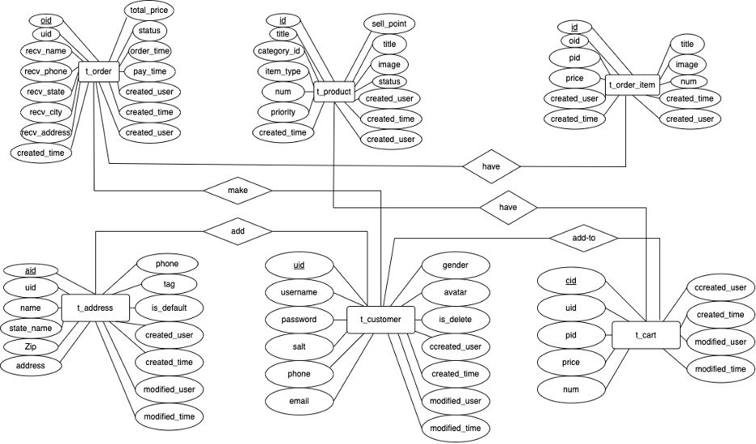
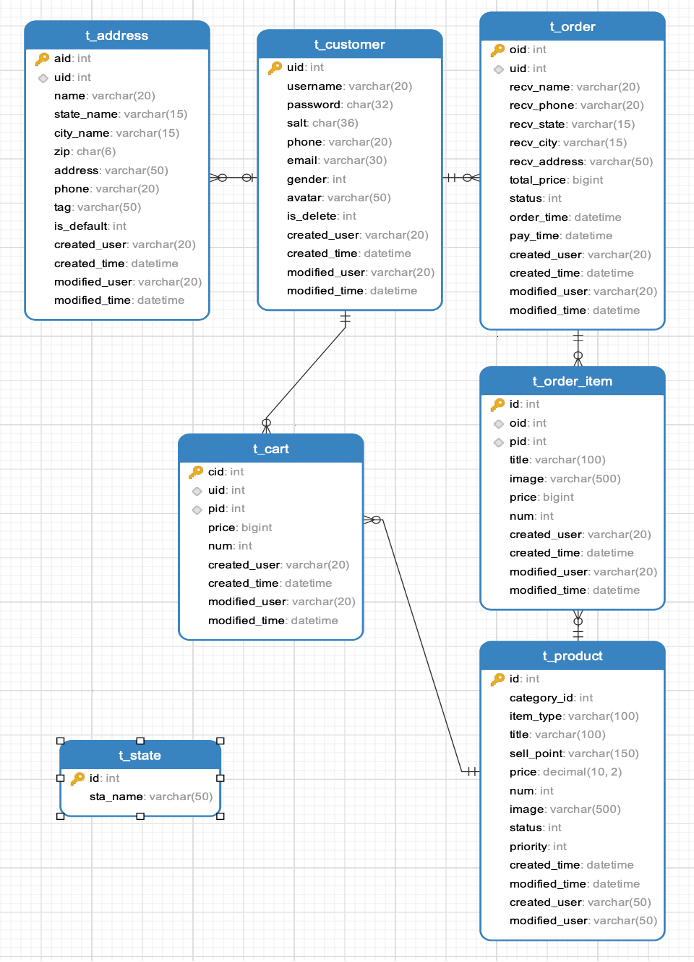
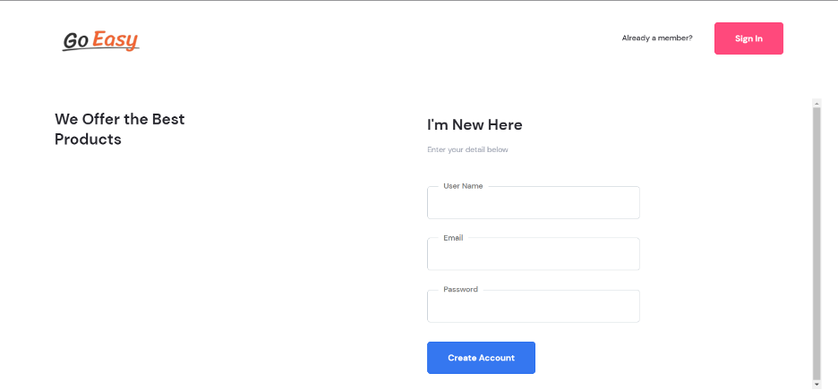
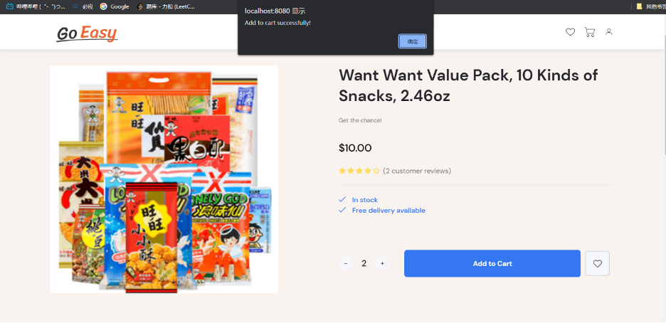
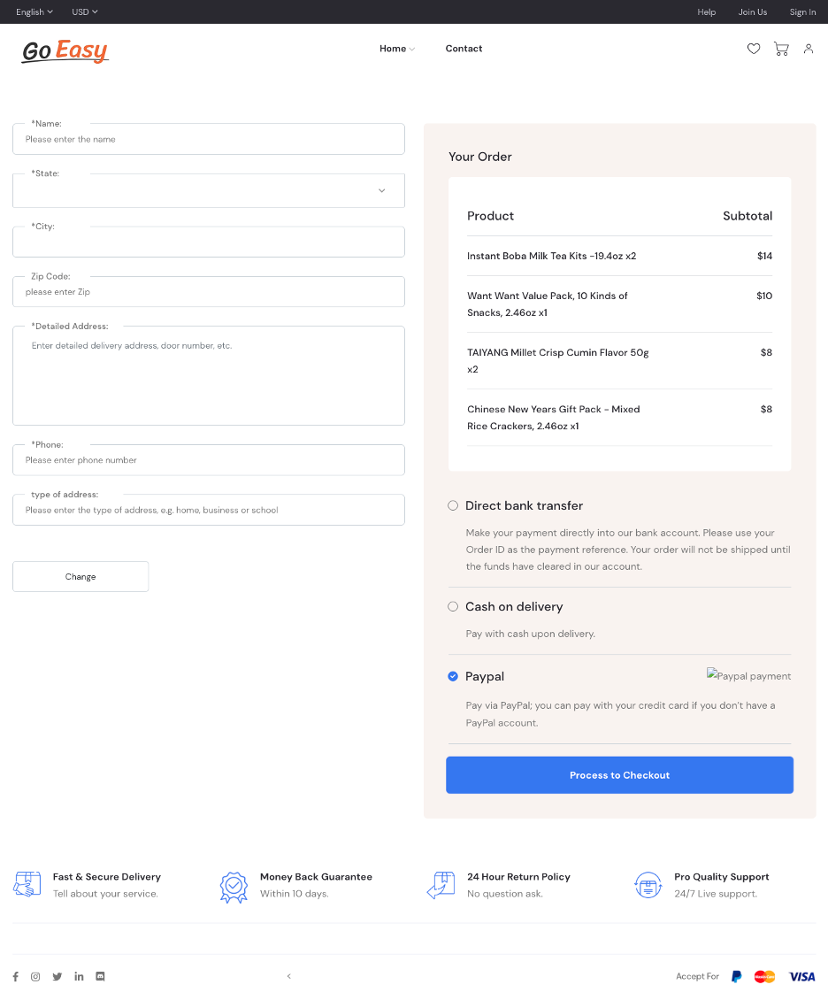
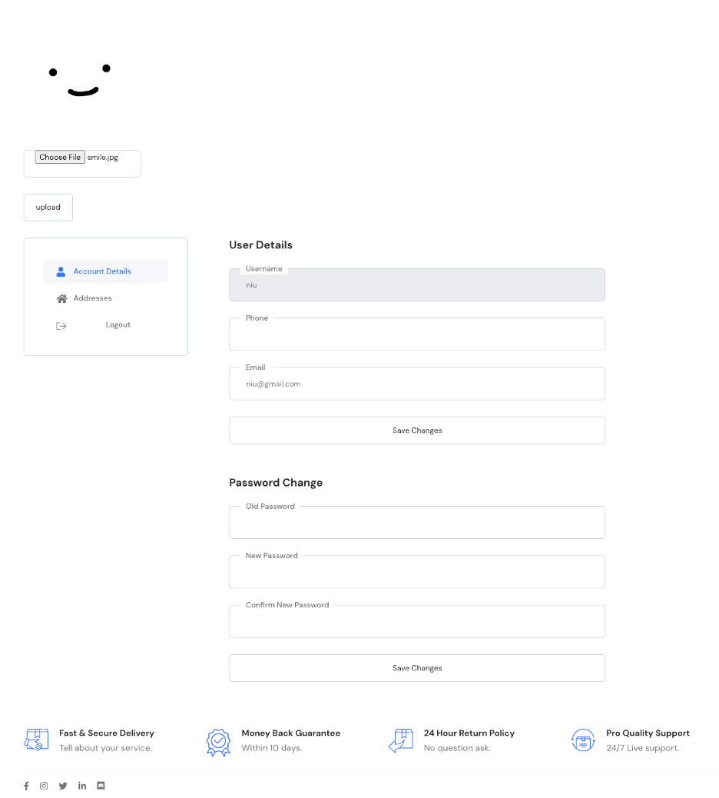

# E-commerce (Grocery)


### Xinyu Ran, Guangyu Niu, John Song

### School of Information Computing, University of Pittsburgh

### INFSCI 2710: Database Management

 

### November 28, 2022 


#### **Introduction**

This is a grocery e-commerce platform to provide Asian style’s groceries, and it mainly targets Asian students who study abroad. This system solves two problems for customers. First, it reduces time cost for students. As international students, they may spend more time on studying and have less time to go shopping. They could simply login, and order groceries online. Second, it resolves the transportation issue. For instance, it is hard to find public transportation besides metro area in America. Students may not have a car to go shopping, and this system could deliver orders to their home easily. 

Customers need to create an account to access the main page to order grocery through the website. 


#### **Design Phase** 

Tools:

​	In order to develop E-commerce platform, there are tools to help this 		project and also accelerate the development process. 

-   Front-end	
    -   HTML
    -   CSS
    -   JS
-   Back-end
    -   SpringBoot: 2.6.12
    -   MyBatis: 2.2.2
    -   Java: 1.8
-   Database
    -   MySQL

SpringBoot would efficiently create stand-alone web platforms without various deployment environments. It integrates data access, web development, test, and etc… to provide various tools to simplify the development. This project mainly bases on Java under the SpringBoot framework. 

AJAX gets data from the server (not images, HTML documents, and other resources) and provides connection between server and front-end page, and it could improve the user experience and reduce the amount of web data transfer. 

MyBatis in the back-end using SpringBoot framework development, maps the MySQL in the add, delete, update, query statements. 

Front-end: our group uses the template and modifies this template to make development cycle shorter. 

Concept: 

​	In E-commerce, the production and inventory management, shopping cart function, payment management, user management, and shipping management need to be developed. In order to develop those functionalities, the integration of front-end, back-end, and database is significant. Since front-end is based on the template, developing relational database and back-end coding are important.

​	Developing relational database: 

-   Production and inventory management: t_product

-   Shopping cart function: t_cart, t_order, t_order_item

-   Payment management: t_order, t_order_item

-   User management: t_customer

-   Shipping management: t_address

Assumption:

-   Filter various categories and factors (ex. Price range, Average Customer Reviews…) 

-   Payment transaction connect to bank account

-   Build and deploy the website in a cloud service.


#### **Implementation** 

ER-diagram:




Relational schema:




MySQL: 

```sql
SET NAMES utf8mb4;
SET FOREIGN_KEY_CHECKS = 0;

-- ----------------------------
-- Table structure for t_address
-- ----------------------------
DROP TABLE IF EXISTS `t_address`;
CREATE TABLE `t_address` (
  `aid` int NOT NULL AUTO_INCREMENT,
  `uid` int DEFAULT NULL,
  `name` varchar(20) CHARACTER SET utf8mb3 COLLATE utf8mb3_general_ci DEFAULT NULL,
  `state_name` varchar(15) CHARACTER SET utf8mb3 COLLATE utf8mb3_general_ci DEFAULT NULL,
  `city_name` varchar(15) CHARACTER SET utf8mb3 COLLATE utf8mb3_general_ci DEFAULT NULL,
  `zip` char(6) CHARACTER SET utf8mb3 COLLATE utf8mb3_general_ci DEFAULT NULL,
  `address` varchar(50) CHARACTER SET utf8mb3 COLLATE utf8mb3_general_ci DEFAULT NULL,
  `phone` varchar(20) CHARACTER SET utf8mb3 COLLATE utf8mb3_general_ci DEFAULT NULL,
  `tag` varchar(50) CHARACTER SET utf8mb3 COLLATE utf8mb3_general_ci DEFAULT NULL,
  `is_default` int DEFAULT NULL,
  `created_user` varchar(20) CHARACTER SET utf8mb3 COLLATE utf8mb3_general_ci DEFAULT NULL,
  `created_time` datetime DEFAULT NULL,
  `modified_user` varchar(20) CHARACTER SET utf8mb3 COLLATE utf8mb3_general_ci DEFAULT NULL,
  `modified_time` datetime DEFAULT NULL,
  PRIMARY KEY (`aid`),
  KEY `uid` (`uid`),
  CONSTRAINT `t_address_ibfk_1` FOREIGN KEY (`uid`) REFERENCES `t_customer` (`uid`)
) ENGINE=InnoDB AUTO_INCREMENT=15 DEFAULT CHARSET=utf8mb3;

-- ----------------------------
-- Table structure for t_cart
-- ----------------------------
DROP TABLE IF EXISTS `t_cart`;
CREATE TABLE `t_cart` (
  `cid` int NOT NULL AUTO_INCREMENT,
  `uid` int NOT NULL,
  `pid` int NOT NULL,
  `price` bigint DEFAULT NULL,
  `num` int DEFAULT NULL,
  `created_user` varchar(20) CHARACTER SET utf8mb3 COLLATE utf8mb3_general_ci DEFAULT NULL,
  `created_time` datetime DEFAULT NULL,
  `modified_user` varchar(20) CHARACTER SET utf8mb3 COLLATE utf8mb3_general_ci DEFAULT NULL,
  `modified_time` datetime DEFAULT NULL,
  PRIMARY KEY (`cid`),
  KEY `cart_uid` (`uid`),
  KEY `cart_pid` (`pid`),
  CONSTRAINT `cart_pid` FOREIGN KEY (`pid`) REFERENCES `t_product` (`id`),
  CONSTRAINT `cart_uid` FOREIGN KEY (`uid`) REFERENCES `t_customer` (`uid`)
) ENGINE=InnoDB AUTO_INCREMENT=27 DEFAULT CHARSET=utf8mb3;

-- ----------------------------
-- Table structure for t_customer
-- ----------------------------
DROP TABLE IF EXISTS `t_customer`;
CREATE TABLE `t_customer` (
  `uid` int NOT NULL AUTO_INCREMENT COMMENT 'user id',
  `username` varchar(20) NOT NULL COMMENT 'username',
  `password` char(32) NOT NULL COMMENT 'password',
  `salt` char(36) DEFAULT NULL COMMENT 'salt used to encrypt',
  `phone` varchar(20) DEFAULT NULL COMMENT 'phone number',
  `email` varchar(30) DEFAULT NULL COMMENT 'email',
  `gender` int DEFAULT NULL COMMENT '0-female 0-male',
  `avatar` varchar(50) CHARACTER SET utf8mb3 COLLATE utf8mb3_general_ci DEFAULT NULL COMMENT 'logo',
  `is_delete` int DEFAULT NULL COMMENT 'delete or not：0-not delete，1-deleted',
  `created_user` varchar(20) DEFAULT NULL COMMENT 'log-created_user',
  `created_time` datetime DEFAULT NULL COMMENT 'log-created_time',
  `modified_user` varchar(20) DEFAULT NULL COMMENT 'log-last modified user',
  `modified_time` datetime DEFAULT NULL COMMENT 'log-last modified time',
  PRIMARY KEY (`uid`)
) ENGINE=InnoDB AUTO_INCREMENT=12 DEFAULT CHARSET=utf8mb3;

-- ----------------------------
-- Table structure for t_order
-- ----------------------------
DROP TABLE IF EXISTS `t_order`;
CREATE TABLE `t_order` (
  `oid` int NOT NULL AUTO_INCREMENT,
  `uid` int NOT NULL,
  `recv_name` varchar(20) CHARACTER SET utf8mb3 COLLATE utf8mb3_general_ci NOT NULL,
  `recv_phone` varchar(20) CHARACTER SET utf8mb3 COLLATE utf8mb3_general_ci DEFAULT NULL,
  `recv_state` varchar(15) CHARACTER SET utf8mb3 COLLATE utf8mb3_general_ci DEFAULT NULL,
  `recv_city` varchar(15) CHARACTER SET utf8mb3 COLLATE utf8mb3_general_ci DEFAULT NULL,
  `recv_address` varchar(50) CHARACTER SET utf8mb3 COLLATE utf8mb3_general_ci DEFAULT NULL,
  `total_price` bigint DEFAULT NULL,
  `status` int DEFAULT NULL,
  `order_time` datetime DEFAULT NULL,
  `pay_time` datetime DEFAULT NULL,
  `created_user` varchar(20) CHARACTER SET utf8mb3 COLLATE utf8mb3_general_ci DEFAULT NULL,
  `created_time` datetime DEFAULT NULL,
  `modified_user` varchar(20) CHARACTER SET utf8mb3 COLLATE utf8mb3_general_ci DEFAULT NULL,
  `modified_time` datetime DEFAULT NULL,
  PRIMARY KEY (`oid`),
  KEY `order_uid` (`uid`),
  CONSTRAINT `order_uid` FOREIGN KEY (`uid`) REFERENCES `t_customer` (`uid`)
) ENGINE=InnoDB AUTO_INCREMENT=2 DEFAULT CHARSET=utf8mb3;

-- ----------------------------
-- Table structure for t_order_item
-- ----------------------------
DROP TABLE IF EXISTS `t_order_item`;
CREATE TABLE `t_order_item` (
  `id` int NOT NULL AUTO_INCREMENT,
  `oid` int NOT NULL,
  `pid` int NOT NULL COMMENT '\n',
  `title` varchar(100) CHARACTER SET utf8mb3 COLLATE utf8mb3_general_ci NOT NULL,
  `image` varchar(500) CHARACTER SET utf8mb3 COLLATE utf8mb3_general_ci DEFAULT NULL,
  `price` bigint DEFAULT NULL,
  `num` int DEFAULT NULL,
  `created_user` varchar(20) CHARACTER SET utf8mb3 COLLATE utf8mb3_general_ci DEFAULT NULL,
  `created_time` datetime DEFAULT NULL,
  `modified_user` varchar(20) CHARACTER SET utf8mb3 COLLATE utf8mb3_general_ci DEFAULT NULL,
  `modified_time` datetime DEFAULT NULL,
  PRIMARY KEY (`id`),
  KEY `item_oid` (`oid`),
  KEY `item_pid` (`pid`),
  CONSTRAINT `item_oid` FOREIGN KEY (`oid`) REFERENCES `t_order` (`oid`),
  CONSTRAINT `item_pid` FOREIGN KEY (`pid`) REFERENCES `t_product` (`id`)
) ENGINE=InnoDB AUTO_INCREMENT=2 DEFAULT CHARSET=utf8mb3;

-- ----------------------------
-- Table structure for t_product
-- ----------------------------
DROP TABLE IF EXISTS `t_product`;
CREATE TABLE `t_product` (
  `id` int NOT NULL,
  `category_id` int DEFAULT NULL,
  `item_type` varchar(100) CHARACTER SET utf8mb3 COLLATE utf8mb3_general_ci DEFAULT NULL,
  `title` varchar(100) CHARACTER SET utf8mb3 COLLATE utf8mb3_general_ci DEFAULT NULL,
  `sell_point` varchar(150) CHARACTER SET utf8mb3 COLLATE utf8mb3_general_ci DEFAULT NULL,
  `price` double DEFAULT NULL,
  `num` int DEFAULT NULL,
  `image` varchar(500) CHARACTER SET utf8mb3 COLLATE utf8mb3_general_ci DEFAULT NULL,
  `status` int DEFAULT '1',
  `priority` int DEFAULT NULL,
  `created_time` datetime DEFAULT NULL,
  `modified_time` datetime DEFAULT NULL,
  `created_user` varchar(50) CHARACTER SET utf8mb3 COLLATE utf8mb3_general_ci DEFAULT NULL,
  `modified_user` varchar(50) CHARACTER SET utf8mb3 COLLATE utf8mb3_general_ci DEFAULT NULL,
  PRIMARY KEY (`id`)
) ENGINE=InnoDB DEFAULT CHARSET=utf8mb3;

-- ----------------------------
-- Table structure for t_state
-- ----------------------------
DROP TABLE IF EXISTS `t_state`;
CREATE TABLE `t_state` (
  `id` int NOT NULL AUTO_INCREMENT,
  `sta_name` varchar(50) NOT NULL COMMENT 'states names',
  PRIMARY KEY (`id`)
) ENGINE=InnoDB AUTO_INCREMENT=52 DEFAULT CHARSET=utf8mb3;

SET FOREIGN_KEY_CHECKS = 1;
```

Back-end & Front-end: 

In the browser, it sends out HTTP requests, receives response, processes the received data, and uses it to render a viewable page. In HTTP request and response payload, the backend uses JSON-formatted data to communicate with front-end. 

AJAX and MyBatis provide connection among front-end-server and java-database. 

Please check this link for coding details. 

https://github.com/QuinceyNiu/db_project


#### **Demo**

Here are screenshots for sign-in, shopping, add cart, add address, and payment processing. 

Sign-in & Sign-up:

​	


Shopping:


Add cart:



Check out:


Payment processing:



User Interface: 




#### **Reflection**

It has basic functionalities for e-commerce, and there are some limitations: 

-   Address default loading at payment page (customers need to manually type address every time).
-   back-end returns back-end with JSON-formatted data: we just return whole table, and it only needs certain attributes in fact. This would be time consuming and space wasted if data is huge. 
-   AOP programming should monitor action and time for each module.
-   Payment processing page need to add and connect to Admin inventory system. 


#### **Conclusion** 

​	Through SpringBoot framework, the e-commerce website has been set up. This project is still a prototype for further development. Our team build up basic functionality, however, there are so many aspects need to make improvements. For example, Admin inventory system need to be added. AOP programming should be monitor for each module. On the other hand, it practically alleviates international students concerns in time cost and transportation problems through this system. This project has achieved shopping cart function, shipping management, and production management. 
